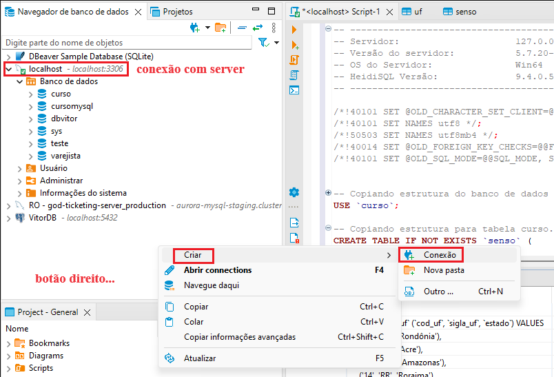
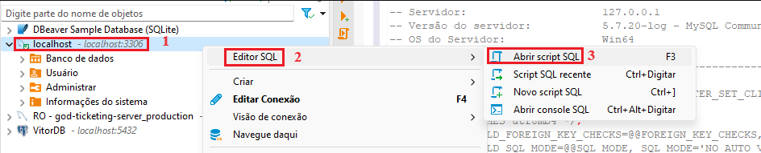
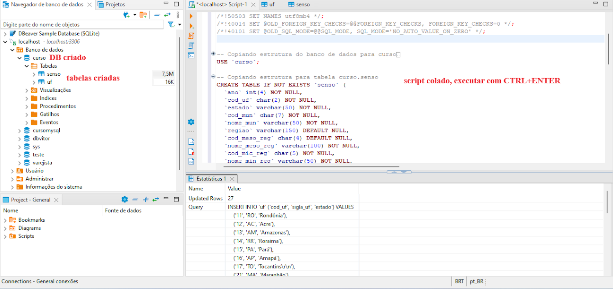

<h2>1. Criação de DB e imports pelo DBeaber</h3>

<p align="justify">
  No DBeaver, criar uma conexão com o server do MySQL instalado na máquina. 
</p>



<p align="justify">
  Clicar com o botão direito sobre a conexão e gerarum arquivo sql novo.
</p>



<p>
  Colar os comandos do arquivo <i>curso.sql</i> de criação do BD, das tabelas e inserts dos dados e executar.
</p>



<h2>2. Database HOSPITAL</h2>

<p align="justify">
  Usado na maioria das resoluções. Sua DDL de criação é:
</p>

```sql
DROP DATABASE IF EXISTS Hospital;

-- Criando DataBase
CREATE DATABASE Hospital;
USE Hospital;

-- Desabilitando check de FKs em inserts
SET FOREIGN_KEY_CHECKS = 0;

-- Criando tabela Medico
CREATE TABLE Medico (
  id INT PRIMARY KEY AUTO_INCREMENT NOT NULL,
  nome VARCHAR(45) NOT NULL,
  crm VARCHAR(45) NOT NULL,
  especialidade ENUM('cardio', 'neuro', 'psico', 'otorrino', 'pneumo') NOT NULL
);

-- Criando tabela Paciente
CREATE TABLE Paciente (
  id INT PRIMARY KEY AUTO_INCREMENT NOT NULL,
  nome VARCHAR(45) NOT NULL,
  cpf VARCHAR(11) NOT null,
  plano ENUM('AMIL', 'SILVESTRE', 'SULAMERICA')
);

-- Criando tabela Consulta
CREATE TABLE Consulta (
  id INT AUTO_INCREMENT NOT NULL,
  medico_id INT NOT NULL,
  paciente_id INT NOT NULL,
  data DATETIME NOT NULL,
  CONSTRAINT `pk_consulta` PRIMARY KEY (id),
  CONSTRAINT `fk_medico` FOREIGN KEY (medico_id) REFERENCES Medico(id),
  CONSTRAINT `fk_paciente` FOREIGN KEY (paciente_id) REFERENCES Paciente(id)
);

-- Criando tabela Remedio
CREATE TABLE Remedio (
  ID INT PRIMARY KEY AUTO_INCREMENT NOT NULL,
  nome VARCHAR(25),
  preco FLOAT,
  planos_cobertos TEXT
);

-- Criando tabela Receita
CREATE TABLE Receita (
  consulta_id INT NOT NULL UNIQUE, -- É uma referência ao id da consulta
  descricao VARCHAR(255) NOT NULL,
  remedio_id INT not NULL,
  CONSTRAINT `fk_receita_consulta` fOREIGN KEY(consulta_id) REFERENCES Consulta(id),
  CONSTRAINT `fk_receita_remedio` fOREIGN KEY(remedio_id) REFERENCES Remedio(ID)
);

-- Inserts para tabela Medico (5 registros)
INSERT INTO Medico (nome, crm, especialidade) VALUES
('Dr. João Santos', '11111', 'cardio'),
('Dra. Maria Silva', '22222', 'neuro'),
('Dr. Pedro Barbosa', '33333', 'psico'),
('Dra. Ana Oliveira', '44444', 'otorrino'),
('Dr. Carlos Gomes', '55555', 'pneumo');

-- Inserts para tabela Paciente (9 registros)
INSERT INTO Paciente (nome, cpf, plano) VALUES
('Fulano da Silva', '11111111111', 'AMIL'),
('Cicrano Souza', '22222222222', 'SILVESTRE'),
('Beltrano Oliveira', '33333333333', 'SULAMERICA'),
('Maria Rodrigues', '44444444444', 'AMIL'),
('José Pereira', '55555555555', 'SILVESTRE'),
('Ana Silva', '66666666666', 'SULAMERICA'),
('Paulo Santos', '77777777777', 'AMIL'),
('Mariana Oliveira', '88888888888', 'SILVESTRE'),
('Pedro Gomes', '99999999999', 'SULAMERICA');

-- Inserts para tabela Consulta (12 registros)
INSERT INTO Consulta (medico_id, paciente_id, data) VALUES
(1, 1, '2022-01-01 09:00:00'),
(2, 2, '2022-01-02 10:30:00'),
(3, 3, '2022-01-03 14:15:00'),
(4, 4, '2022-01-04 16:45:00'),
(5, 5, '2022-01-01 11:30:00'),
(1, 6, '2022-01-02 13:00:00'),
(2, 7, '2022-01-03 10:00:00'),
(3, 8, '2022-01-01 15:45:00'),
(4, 9, '2022-01-03 17:30:00'),
(5, 1, '2022-01-01 09:30:00'),
(1, 2, '2022-01-02 16:00:00'),
(2, 3, '2022-01-04 14:45:00');

-- Inserts para tabela Remedio (15 registros)
INSERT INTO Remedio (nome, preco, planos_cobertos) VALUES
('Remedio 1', 10.5, 'AMIL,SILVESTRE'),
('Remedio 2', 20.75, 'AMIL'),
('Remedio 3', 15.0, 'SILVESTRE'),
('Remedio 4', 30.25, 'AMIL,SILVESTRE,SULAMERICA'),
('Remedio 5', 12.0, 'SULAMERICA'),
('Remedio 6', 18.5, NULL),
('Remedio 7', 25.0, 'AMIL,SULAMERICA'),
('Remedio 8', 8.75, 'SILVESTRE'),
('Remedio 9', 16.5, 'AMIL,SULAMERICA'),
('Remedio 10', 22.5, 'AMIL,SILVESTRE'),
('Remedio 11', 14.25, 'SILVESTRE,SULAMERICA'),
('Remedio 12', 17.75, 'AMIL'),
('Remedio 13', 11.5, 'SULAMERICA'),
('Remedio 14', 19.0, 'AMIL,SILVESTRE'),
('Remedio 15', 32.0, 'AMIL,SULAMERICA');

-- Inserts para tabela Receita (12 registros)
INSERT INTO Receita (consulta_id, descricao, remedio_id) VALUES
(1, 'Prescrição A', 1),
(2, 'Prescrição B', 2),
(3, 'Prescrição C', 3),
(4, 'Prescrição D', 4),
(5, 'Prescrição E', 5),
(6, 'Prescrição F', 6),
(7, 'Prescrição G', 7),
(8, 'Prescrição H', 8),
(9, 'Prescrição I', 9),
(10, 'Prescrição J', 10),
(11, 'Prescrição K', 11),
(12, 'Prescrição L', 12);


-- Habilitando check de FKs em inserts
SET FOREIGN_KEY_CHECKS = 1;
```

<p align="justify">
  E suas tabelas, após criadas, conterão:
</p>

```sql
select * from consulta;
```

```plainText
+----+-----------+-------------+------------------+
| id | medico_id | paciente_id | data             |
+----+-----------+-------------+------------------+
| 1  | 1         | 1           | 01/01/2022 09:00 |
| 2  | 2         | 2           | 02/01/2022 10:30 |
| 3  | 3         | 3           | 03/01/2022 14:15 |
| 4  | 4         | 4           | 04/01/2022 16:45 |
| 5  | 5         | 5           | 01/01/2022 11:30 |
| 6  | 1         | 6           | 02/01/2022 13:00 |
| 7  | 2         | 7           | 03/01/2022 10:00 |
| 8  | 3         | 8           | 01/01/2022 15:45 |
| 9  | 4         | 9           | 03/01/2022 17:30 |
| 10 | 5         | 1           | 01/01/2022 09:30 |
| 11 | 1         | 2           | 02/01/2022 16:00 |
| 12 | 2         | 3           | 04/01/2022 14:45 |
+----+-----------+-------------+------------------+
```

```sql
select * from medico;
```

```plainText
+----+-------------------+-------+---------------+
| id | nome              | crm   | especialidade |
+----+-------------------+-------+---------------+
| 1  | Dr. João Santos   | 11111 | cardio        |
| 2  | Dra. Maria Silva  | 22222 | neuro         |
| 3  | Dr. Pedro Barbosa | 33333 | psico         |
| 4  | Dra. Ana Oliveira | 44444 | otorrino      |
| 5  | Dr. Carlos Gomes  | 55555 | pneumo        |
+----+-------------------+-------+---------------+
```

```sql
select * paciente;
```

```plainText
+----+-------------------+-------------+------------+
| id | nome              | cpf         | plano      |
+----+-------------------+-------------+------------+
| 1  | Fulano da Silva   | 11111111111 | AMIL       |
| 2  | Cicrano Souza     | 22222222222 | SILVESTRE  |
| 3  | Beltrano Oliveira | 33333333333 | SULAMERICA |
| 4  | Maria Rodrigues   | 44444444444 | AMIL       |
| 5  | José Pereira      | 55555555555 | SILVESTRE  |
| 6  | Ana Silva         | 66666666666 | SULAMERICA |
| 7  | Paulo Santos      | 77777777777 | AMIL       |
| 8  | Mariana Oliveira  | 88888888888 | SILVESTRE  |
| 9  | Pedro Gomes       | 99999999999 | SULAMERICA |
+----+-------------------+-------------+------------+
```

```sql
select * from receita;
```

```plainText
+----------+--------------+------------+
| consulta | descricao    | remedio_id |
+----------+--------------+------------+
| 1        | Prescrição A | 1          |
| 2        | Prescrição B | 2          |
| 3        | Prescrição C | 3          |
| 4        | Prescrição D | 4          |
| 5        | Prescrição E | 5          |
| 6        | Prescrição F | 6          |
| 7        | Prescrição G | 7          |
| 8        | Prescrição H | 8          |
| 9        | Prescrição I | 9          |
| 10       | Prescrição J | 10         |
| 11       | Prescrição K | 11         |
| 12       | Prescrição L | 12         |
+----------+--------------+------------+
```

```sql
select * from remedio;
```

```plainText
+----+------------+---------+---------------------------+
| ID | nome       | preco   | planos_cobertos           |
+----+------------+---------+---------------------------+
| 1  | Remedio 1  | 10.5    | AMIL,SILVESTRE            |
| 2  | Remedio 2  | 20.75   | AMIL                      |
| 3  | Remedio 3  | 15.0    | SILVESTRE                 |
| 4  | Remedio 4  | 30.25   | AMIL,SILVESTRE,SULAMERICA |
| 5  | Remedio 5  | 12.0    | SULAMERICA                |
| 6  | Remedio 6  | 18.5    |                           |
| 7  | Remedio 7  | 25.0    | AMIL,SULAMERICA           |
| 8  | Remedio 8  | 8.75    | SILVESTRE                 |
| 9  | Remedio 9  | 16.5    | AMIL,SULAMERICA           |
| 10 | Remedio 10 | 22.5    | AMIL,SILVESTRE            |
| 11 | Remedio 11 | 14.25   | SILVESTRE,SULAMERICA      |
| 12 | Remedio 12 | 17.75   | AMIL                      |
| 13 | Remedio 13 | 11.5    | SULAMERICA                |
| 14 | Remedio 14 | 19.0    | AMIL,SILVESTRE            |
| 15 | Remedio 15 | 32.0    | AMIL,SULAMERICA           |
+----+------------+---------+---------------------------+
```
