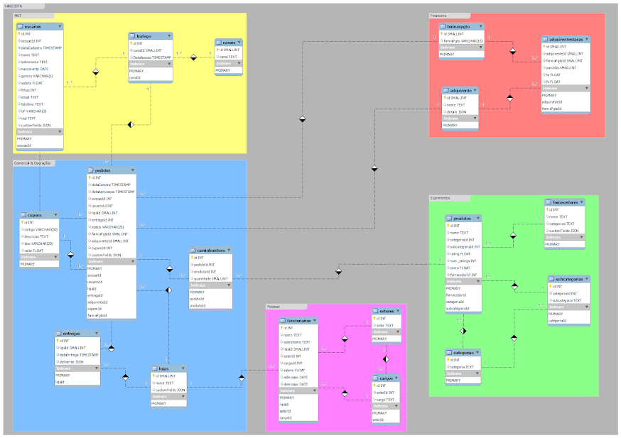
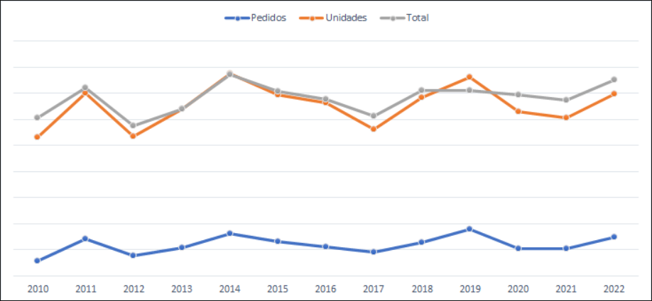
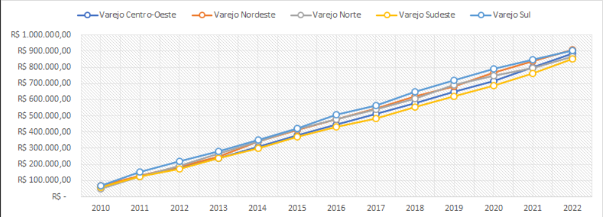

<h1>1. ARQUIVOS</h1>

<p align="justify"><b>1. selfContained</b></p>

<p align="justify">Contém um arquivo SQL para execução única de criação:</p>
<ul>
 <p align="justify"><li>do database 'varejista'</li></p>
 <p align="justify"><li>das tabelas</li></p>
 <p align="justify"><li>inserção dos registros</li></p>
</ul>

<p align="justify"><b>2. separatedSchemaTables</b></p>

<p align="justify">Contém cada arquivo SQL de criação:</p>
<ul>
 <p align="justify"><li>do database 'varejista'</li></p>
 <p align="justify"><li>das tabelas</li></p>
 <p align="justify"><li>inserção dos registros</li></p>
</ul>

<p align="justify"><b>3. Model</b></p>

<p align="justify">Contém o modelo na extensão wmb do MySQL Workbench. Ao abrir no MySQL Workbench, terá:</p>
<ul>
 <p align="justify"><li>O diagrama relacional das tabelas</li></p>
 <p align="justify"><li>Os scripts de criação do schema</li></p>
 <p align="justify"><li>Os scripts de criação das tabelas</li></p>
 <p align="justify"><li>Os scripts de inserção dos registros</li></p>
</ul>

<p align="justify"><b>4. Diagrama</b></p>


<p align="justify">Contém o diagrama relacional (reverse engineering, CTRL+R) com as relações de chaves entre tabelas em PDF.</p>
 


<h1>2. TABELAS</h1>
<p align="justify">Das tabelas do cubo, tem-se:</p>
 
<table align="center">
    <thead>
        <tr>
            <th>GRUPO</th>
            <th>TABELA (as)</th>
            <th>DESCRIÇÃO</th>
            <th>RELAÇÕES</th>
        </tr>
    </thead>
    <tbody>
        <tr>
            <td>MKT</td>
            <td>usuarios (u)</td>
            <td>Users cadastrados na plataforma.</td>
            <td>&#x2022; u.sessaoId=t.Id, <br>&#x2022; u.Id=p.usuarioId</td>
        </tr>
        <tr>
            <td>MKT</td>
            <td>trafego (t)</td>
            <td>Informações do tráfego no site.</td>
            <td>&#x2022; t.Id=u.sessaoId, <br>&#x2022; t.canalId=cn.Id, <br>&#x2022; t.Id=p.sessaoId</td>
        </tr>
        <tr>
            <td>MKT</td>
            <td>canais (cn)</td>
            <td>Qual meio de comunicação <br>ele chegou na plataforma.</td>
            <td>&#x2022; cn.Id=t.canalId</td>
        </tr>
        <tr>
            <td>Comercial &amp; Operações</td>
            <td>pedidos (p)</td>
            <td>Compras feitas na plataforma.</td>
            <td>&#x2022; p.Id=ci.pedidoId, <br>&#x2022; p.cupomId=c.Id, <br>&#x2022; p.lojaId=l.Id, <br>&#x2022; p.entregaId=e.Id, <br>&#x2022; p.formaPgtoId=fp.Id, <br>&#x2022; p.adquirenteId=ad.Id</td>
        </tr>
        <tr>
            <td>Comercial &amp; Operações</td>
            <td>cupons (c)</td>
            <td>Lista de cupons cadastrados.</td>
            <td>&#x2022; c.Id=p.cupomId</td>
        </tr>
        <tr>
            <td>Comercial &amp; Operações</td>
            <td>carrinhositens (ci)</td>
            <td>Informações de produtos <br>contidos em cada pedido.</td>
            <td>&#x2022; ci.pedidoId=p.Id, <br>&#x2022; ci.produtoId=p.Id</td>
        </tr>
        <tr>
            <td>Comercial &amp; Operações</td>
            <td>entregas (e)</td>
            <td>Dados das entregas dos pedidos.</td>
            <td>&#x2022; e.Id=p.entregasId, <br>&#x2022; e.lojaId=l.Id</td>
        </tr>
        <tr>
            <td>Comercial &amp; Operações</td>
            <td>lojas (l)</td>
            <td>Informações das lojas da rede.</td>
            <td>&#x2022; l.Id=e.lojaId, <br>&#x2022; l.Id=p.lojaId, <br>&#x2022; l.Id=f.lojaId</td>
        </tr>
        <tr>
            <td>Pessoas</td>
            <td>funcionarios (f)</td>
            <td>Informações de colaboradores.</td>
            <td>&#x2022; f.lojaId=l.Id, <br>&#x2022; f.setorId=s.Id, <br>&#x2022; f.cargoId=cg.Id</td>
        </tr>
        <tr>
            <td>Pessoas</td>
            <td>setores (s)</td>
            <td>Informações dos setores das lojas.</td>
            <td>&#x2022; s.Id=f.setorId, <br>&#x2022; s.Id=cg.setorId</td>
        </tr>
        <tr>
            <td>Pessoas</td>
            <td>cargos (cg)</td>
            <td>Informações dos cargos das lojas.</td>
            <td>&#x2022; cg.Id=f.cargoId, <br>&#x2022; cg.setorId=s.Id</td>
        </tr>
        <tr>
            <td>Suprimentos</td>
            <td>produtos (pr)</td>
            <td>Dados dos produtos cadastrados.</td>
            <td>&#x2022; p.fornecedorId=fn.Id, <br>&#x2022; p.subcategoriaId=sct.Id, <br>&#x2022; p.categoriaId = ct.Id</td>
        </tr>
        <tr>
            <td>Suprimentos</td>
            <td>fornecedores (fn)</td>
            <td>Dados dos fornecedores cadastrados.</td>
            <td>&#x2022; fn.Id=p.fornecedorId</td>
        </tr>
        <tr>
            <td>Suprimentos</td>
            <td>categorias (ct)</td>
            <td>Categoria dos produtos.</td>
            <td>&#x2022; ct.Id=p.categoriaId, <br>&#x2022; ct.Id=sct.categoriaId</td>
        </tr>
        <tr>
            <td>Suprimentos</td>
            <td>subcategorias (sct)</td>
            <td>Subcategoria dos produtos.</td>
            <td>&#x2022; sct.Id=p.subcategoriaId, <br>&#x2022; sct.categoriaId=ct.Id</td>
        </tr>
        <tr>
            <td>Financeiro</td>
            <td>formaspgto (fp)</td>
            <td>Informações das formas <br>de pagamento aceitas.</td>
            <td>&#x2022; fp.Id=tad.formaPgtoId, <br>&#x2022; fp.Id=p.formaPgtoId</td>
        </tr>
        <tr>
            <td>Financeiro</td>
            <td>adquirente (ad)</td>
            <td>Dados de parceiros que <br>processam as transações.</td>
            <td>&#x2022; ad.Id=tad.adquirenteId, <br>&#x2022; ad.Id=p.adquirenteId</td>
        </tr>
        <tr>
            <td>Financeiro</td>
            <td>adquirentetaxas (tad)</td>
            <td>Taxas cobradas pelos parceiros <br>que processam as transações.</td>
            <td>&#x2022; tad.formaPgtoId=fp.Id, <br>&#x2022; tad.adquirenteId=ad.Id</td>
        </tr>
    </tbody>
</table>
 
```sql
select * from usuarios limit 4;
```

```ASCII
+----+----------+------------------+----------+-----------+------------+--------+---------+--------+----------------------------+----------------+----+----------+------------------------------------------------------------------------------------------------------------------------------------------------------------------------------------------------------------------------------------------------------------------+
| id | sessaoId | dataCadastro     | nome     | sobrenome | nascimento | genero | salario | filhos | email                      | telefone       | UF | cep      | customFields                                                                                                                                                                                                                                                     |
+----+----------+------------------+----------+-----------+------------+--------+---------+--------+----------------------------+----------------+----+----------+------------------------------------------------------------------------------------------------------------------------------------------------------------------------------------------------------------------------------------------------------------------+
| 1  | 2525     | 12/01/2013 11:10 | Yasmin   | Costa     | 12/04/1976 | F      | 3537    | 3      | yasmin.costa@hotmail.com   | +5585947197309 | CE | 60531240 | {"LatLong": [-3.76134600000001, -38.6052879], "latitude": -3.76134600000001, "longitude": -38.6052879, "addressDetails": {"Localidade/UF": ["Fortaleza", "CE"], "Bairro/Distrito": "Conjunto Ceará I", "Logradouro/Nome": "Rua 448F"}}                           |
| 2  | 1822     | 13/10/2021 02:57 | Milena   | Berude    | 20/07/1956 | F      | 4289.5  | 2      | milena-berude@icloud.com   | +5567968586436 | MS | 79052061 | {"LatLong": [-20.4997728, -54.5888421999999], "latitude": -20.4997728, "longitude": -54.5888421999999, "addressDetails": {"Localidade/UF": ["Campo Grande", "MS"], "Bairro/Distrito": "Vila Morumbi", "Logradouro/Nome": "Rua Assunção"}}                        |
| 3  | 14981    | 21/10/2018 01:21 | Henrique | Hoffman   | 02/07/1978 | M      | 5372.77 | 4      | henriquehoffman@gmail.com  | +5541953177754 | PR | 81470360 | {"LatLong": [-25.577042, -49.336916], "latitude": -25.577042, "longitude": -49.336916, "addressDetails": {"Localidade/UF": ["Curitiba", "PR"], "Bairro/Distrito": "Tatuquara", "Logradouro/Nome": "Rua Professora Clara Kaehler"}}                               |
| 4  | 3784     | 20/02/2014 01:51 | Manuela  | Falquetto | 27/04/1958 | F      | 3686.73 | 2      | manuelafalquetto@gmail.com | +5584930001991 | RN | 59064620 | {"LatLong": [-5.84110229999998, -35.2117557999999], "latitude": -5.84110229999998, "longitude": -35.2117557999999, "addressDetails": {"Localidade/UF": ["Natal", "RN"], "Bairro/Distrito": "Candelária", "Logradouro/Nome": "Largo Interventor Ubaldo Bezerra"}} |
+----+----------+------------------+----------+-----------+------------+--------+---------+--------+----------------------------+----------------+----+----------+------------------------------------------------------------------------------------------------------------------------------------------------------------------------------------------------------------------------------------------------------------------+ 
 ```
 
 ```sql
select * from trafego limit 4;
```

```ASCII
+----+------------------+------------------+
| id | canalId          | DataAcesso       |
+----+------------------+------------------+
| 1  |                3 | 12/01/2013 11:10 |
| 2  |                3 | 17/01/2013 08:28 |
| 3  |                4 | 26/01/2013 04:57 |
| 4  |                4 | 31/01/2013 19:36 |
+----+------------------+------------------+
```
 
```sql
select * from canais limit 4;
```

```ascii
+----+----------+
| id | canal    |
+----+----------+
| 1  | baner    |
| 2  | email    |
| 3  | whatsapp |
| 4  | telegram |
+----+----------+
```

```sql
select * from pedidos limit 4;
```

```ascii
+----+------------------+------------------+----------+-----------+--------+-----------+----------------------+-------------+--------------+---------+-------------------------------------------------------------------------------------------------------------------------------------------+
| id | dataCompra       | dataAprovacao    | sessaoId | usuarioId | lojaId | entregaId | status               | formaPgtoId | adquirenteId | cupomId | customFields                                                                                                                              |
+----+------------------+------------------+----------+-----------+--------+-----------+----------------------+-------------+--------------+---------+-------------------------------------------------------------------------------------------------------------------------------------------+
| 1  | 12/01/2013 11:10 | 14/01/2013 00:00 | 2525     | 1         | 4      | 1901      | aprovado             | 1           | 2            |         | {"parcelas": 2, "parcela_1": "2011-08-04", "parcela_2": "2011-09-03", "parcela_3": "", "parcela_4": "", "parcela_5": "", "parcela_6": ""} |
| 2  | 17/01/2013 08:28 | 21/01/2013 00:00 | 16255    | 1         | 1      | 1908      | aprovado             | 3           | 3            |         | {"parcelas": 0, "parcela_1": "", "parcela_2": "", "parcela_3": "", "parcela_4": "", "parcela_5": "", "parcela_6": ""}                     |
| 3  | 31/01/2013 19:36 |                  | 24651    | 1         | 4      |           | cancelado            | 3           | 3            | 290     | {"parcelas": 0, "parcela_1": "", "parcela_2": "", "parcela_3": "", "parcela_4": "", "parcela_5": "", "parcela_6": ""}                     |
| 4  | 08/02/2013 02:24 |                  | 30771    | 1         | 1      |           | aguardando pagamento | 2           | 3            | 291     | {"parcelas": 0, "parcela_1": "", "parcela_2": "", "parcela_3": "", "parcela_4": "", "parcela_5": "", "parcela_6": ""}                     |
+----+------------------+------------------+----------+-----------+--------+-----------+----------------------+-------------+--------------+---------+-------------------------------------------------------------------------------------------------------------------------------------------+
```

```sql
select * from cupons limit 4;
```

```ascii
+----+----------+------------------+------------+-------+
| id | codigo   | descricao        | tipo       | valor |
+----+----------+------------------+------------+-------+
| 1  | DSE76317 | OFF_N100         | nominal    | 100   |
| 2  | F8203365 | Clown Town_P0.10 | percentual | 0.1   |
| 3  | GSFH5305 | SELLOUTS_N650    | nominal    | 650   |
| 4  | GA166722 | CRAZYSALES_P0.80 | percentual | 0.8   |
+----+----------+------------------+------------+-------+
```

```sql
select * from carrinhositens limit 4;
```

```ascii
+----+----------+-----------+------------+
| id | pedidoId | produtoId | quantitade |
+----+----------+-----------+------------+
| 1  | 1        | 2847      | 1          |
| 2  | 1        | 5133      | 1          |
| 3  | 2        | 8014      | 1          |
| 4  | 2        | 10460     | 2          |
+----+----------+-----------+------------+
```

```sql
select * from entregas limit 4;
```

```ascii
+----+--------+------------------+------------------------------------------------------------------------------------------------------------+
| id | lojaId | dataEntrega      | deliveries                                                                                                 |
+----+--------+------------------+------------------------------------------------------------------------------------------------------------+
| 1  | 3      | 03/01/2010 00:00 | {"user": [3166, null, null, null, null, null, null], "pedido": [9659, null, null, null, null, null, null]} |
| 2  | 4      | 07/01/2010 00:00 | {"user": [620, null, null, null, null, null, null], "pedido": [1581, null, null, null, null, null, null]}  |
| 3  | 1      | 10/01/2010 00:00 | {"user": [622, null, null, null, null, null, null], "pedido": [563, null, null, null, null, null, null]}   |
| 4  | 3      | 10/01/2010 00:00 | {"user": [1541, null, null, null, null, null, null], "pedido": [6859, null, null, null, null, null, null]} |
+----+--------+------------------+------------------------------------------------------------------------------------------------------------+
```

```sql
select * from lojas limit 4;
```

```ascii
+----+---------------------+------------------------------------------------------------------------+
| id | nome                | customFields                                                           |
+----+---------------------+------------------------------------------------------------------------+
| 1  | Varejo Nordeste     | {"lat": -3.7568793, "long": -38.4899163, "place": "Iguatemi Shopping"} |
| 2  | Varejo Norte        | {"lat": -3.1227671, "long": -60.0283638, "place": "Zona Franca"}       |
| 3  | Varejo Sudeste      | {"lat": -22.943855, "long": -43.180894, "place": "Botafogo"}           |
| 4  | Varejo Centro-Oeste | {"lat": -15.817977, "long": -47.875365, "place": "Pier 21"}            |
+----+---------------------+------------------------------------------------------------------------+
```

```sql
select * from funcionarios limit 4;
```

```ascii
+----+-----------+-----------+--------+---------+---------+---------+------------+------------+
| id | nome      | sobrenome | lojaId | setorId | cargoId | salario | admissao   | demissao   |
+----+-----------+-----------+--------+---------+---------+---------+------------+------------+
| 1  | Francisco |  Fardin   | 3      | 1       | 9       | 7410    | 12/02/2021 |            |
| 2  | Heitor    |  Romão    | 3      | 2       | 12      | 1500    | 28/10/2022 | 19/02/2023 |
| 3  | Gabriela  |  Lazarin  | 5      | 1       | 9       | 7410    | 09/05/2011 | 26/11/2020 |
| 4  | Gustavo   | Nacaratti | 3      | 4       | 9       | 7020    | 09/01/2018 |            |
+----+-----------+-----------+--------+---------+---------+---------+------------+------------+
```

```sql
select * from setores limit 4;
```

```ascii
+----+------------+
| id | setor      |
+----+------------+
| 1  | RH         |
| 2  | financeiro |
| 3  | RH         |
| 4  | transporte |
+----+------------+
```

```sql
select * from cargos limit 4;
```

```ascii
+----+---------+-------------+
| id | setorId | cargo       |
+----+---------+-------------+
| 1  | 5       | caixa       |
| 2  | 5       | coordenador |
| 3  | 5       | diretor     |
| 4  | 5       | gerente     |
+----+---------+-------------+
```

```sql
select * from produtos limit 4;
```

```ascii
+----+-----------------------------------------------+-------------+----------------+--------+-------------+-------+--------------+
| id | nome                                          | categoriaId | subcategoriaId | rating | num_ratings | preco | fornecedorId |
+----+-----------------------------------------------+-------------+----------------+--------+-------------+-------+--------------+
| 1  | AmazonBasics 74 cm Navy Blue Softsided Check  | 1           | 1              | 4.2    | 854         | 620   | 3            |
| 2  | Urban Forest Taylor 7 Ltrs Leather Laptop Bag | 1           | 1              | 3.7    | 84          | 744   | 3            |
| 3  | Urban Forest Taylor 7 Ltrs Leather Laptop Bag | 1           | 1              | 3.7    | 84          | 744   | 3            |
| 4  | AmazonBasics 2-Piece Set (20', 28'), Green    | 1           | 1              | 4.6    | 74          | 1240  | 3            |
+----+-----------------------------------------------+-------------+----------------+--------+-------------+-------+--------------+
```

```sql
select * from fornecedores limit 4;
```

```ascii
+----+---------+--------------------------------------------------------------------------+-----------------------------------------------------------------------------------+
| id | nome    | categorias                                                               | customFields                                                                      |
+----+---------+--------------------------------------------------------------------------+-----------------------------------------------------------------------------------+
| 1  | Gustto  | men's shoes;bags & luggage;women's shoes;women's clothing;men's clothing | {"lat": 46.5791583, "long": 1.1761953, "Country": "FR", "amount_unit_ship": 7.7}  |
| 2  | Sunny   | tv, audio & cameras;appliances                                           | {"lat": 35.857906, "long": 139.654297, "Country": "JA", "amount_unit_ship": 8.9}  |
| 3  | General | stores;accessories                                                       | {"lat": 39.35886, "long": -123.087591, "Country": "USA", "amount_unit_ship": 6.2} |
| 4  | Nuke    | sports & fitness                                                         | {"lat": 20.860389, "long": 79.356943, "Country": "IN", "amount_unit_ship": 2.1}   |
+----+---------+--------------------------------------------------------------------------+-----------------------------------------------------------------------------------+
```

```sql
select * from categorias limit 4;
```

```ascii
+----+-----------------+
| id | categoria       |
+----+-----------------+
| 1  | accessories     |
| 2  | appliances      |
| 3  | bags & luggage  |
| 4  | beauty & health |
+----+-----------------+
```

```sql
select * from subcategorias limit 4;
```

```ascii
+----+-------------+----------------------------+
| id | categoriaId | subcategoria               |
+----+-------------+----------------------------+
| 1  | 1           | Bags & Luggage             |
| 2  | 1           | Fashion & Silver Jewellery |
| 3  | 1           | Gold & Diamond Jewellery   |
| 4  | 1           | Handbags & Clutches        |
+----+-------------+----------------------------+
```

```sql
select * from formaspgto limit 4;
```

```ascii
+----+-----------+
| id | formaPgto |
+----+-----------+
| 1  | cartão    |
| 2  | boleto    |
| 3  | pix       |
+----+-----------+
```

```sql
select * from adquirente limit 4;
```

```ascii
+----+---------+------------------------------------------------------------------------------------+
| id | nome    | details                                                                            |
+----+---------+------------------------------------------------------------------------------------+
| 1  | CIELO   | {"tx": [0.02, 0.024, 0.028, 0.032, 0.036, 0.04], "parcelas": [1, 2, 3, 4, 5, 6]}   |
| 2  | REDE    | {"tx": [0.015, 0.021, 0.027, 0.033, 0.039, 0.045], "parcelas": [1, 2, 3, 4, 5, 6]} |
| 3  | PAGARME | {"tx": [0.0, 0.0, 0.0, 0.0, 0.0, 0.0], "parcelas": [1, 2, 3, 4, 5, 6]}             |
+----+---------+------------------------------------------------------------------------------------+
```

```sql
select * from adquirentestaxas limit 4;
```

```ascii
+----+--------------+-------------+----------+-------+----+
| id | adquirenteId | formaPgtoId | parcelas | tx    | fx |
+----+--------------+-------------+----------+-------+----+
| 1  | 1            | 1           | 1        | 0.02  | 0  |
| 2  | 1            | 1           | 2        | 0.024 | 0  |
| 3  | 1            | 1           | 3        | 0.028 | 0  |
| 4  | 1            | 1           | 4        | 0.032 | 0  |
+----+--------------+-------------+----------+-------+----+
```

<h1>3. CONSULTAS</h1>
<h3 align="justify">3.1. Dos pedidos aprovados (pagos) e comprados no último ano e apenas os 10 pedidos mais caros, total do valor do pedido e total dos itens comprados, agrupados por dia da compra, nº do pedido, status, data da entrega e loja. Também, retornar o nome dos itens do carrinho e o volume de cada item:</h3>

```sql
select
  a.`dataCompra`
, a.`pedidoId`
, a.`pedidoStatus`
, a.`dataEntrega`
, a.`loja`
, group_concat(a.`produto`)         as `produtos`
, group_concat(a.`qtde`)            as `itensQtdes`
, group_concat(a.`preco`)           as `itensPrecos`
, a.`itensPedido`
, round(sum(a.`total`), 2)          as `totalPedido`
from (
select 
  cast(p.`dataCompra` as date)                      as `dataCompra`
, p.`id`                                            as `pedidoId`
, p.`status`                                        as `pedidoStatus`
, fp.`formaPgto`                                    as `formaPgto`
, cast(e.`dataEntrega` as date)                     as `dataEntrega`
, l.`nome`                                          as `loja`
, pr.`nome`                                         as `produto`
, ci.`quantitade`                                   as `qtde`
, sum(ci.`quantitade`) over(partition by p.`id`)    as `itensPedido`
, pr.`preco`                                        as `preco`
, round(ci.`quantitade` * pr.`preco`, 2)            as `total`
from pedidos p
	left join carrinhositens ci     on p.id = ci.pedidoId
	left join formaspgto fp         on p.formaPgtoId = fp.id
	left join entregas e            on p.entregaId = e.id
	left join lojas l               on e.lojaId = l.id
	left join produtos pr           on pr.id = ci.produtoId
where p.status = "aprovado"
  and year(p.`dataCompra`) >= year(curdate())   -- ou trocar year(curdate()) por 2023
) as a
group by a.`dataCompra`, a.`pedidoId`, a.`pedidoStatus`, a.`dataEntrega`, a.`loja`, a.`itensPedido`
order by `totalPedido` desc limit 10
;
```

```ascii
+------------+----------+--------------+-------------+---------------------+--------------------------------------------------------------------------------------------------------------------------------------+-----------+----------------------+-------------+-------------+
| dataCompra | pedidoId | pedidoStatus | dataEntrega | loja                | produtos                                                                                                                             | itensQtde | itensPrecos          | itensPedido | totalPedido |
+------------+----------+--------------+-------------+---------------------+--------------------------------------------------------------------------------------------------------------------------------------+-----------+----------------------+-------------+-------------+
| 18/01/2023 | 2149     | aprovado     | 29/12/2022  | Varejo Sul          | toothless Kids Girls Sea Green/Pink Clogs,hummel Unisex-Adult Legend Breather Sneaker,GUESS Analog Black Dial Men's Watch-GW0111L3   | 1,1,3     | 49.54,173.54,923.8   | 5           | 2994.48     |
| 06/01/2023 | 2148     | aprovado     | 20/12/2022  | Varejo Centro-Oeste | Qual 02 Ton Scissor Jack for Vehicle Lift,LEOTUDE Regular Fit Full Sleeve Men's T-Shirt,Skagen 16 mm Solar Stainless Steel Watch     | 2,2,2     | 37.14,68.14,836.69   | 6           | 1883.94     |
| 19/01/2023 | 8144     | aprovado     | 30/12/2022  | Varejo Sul          | Ruggers by Unlimited Men's Regular Fit Shirt,Havells Turboforce 300mm Exhaust Fan (Grey),Wrangler Men's Slim Jeans (WMJNSM4427_Blue  | 1,3,2     | 99.14,287.06,173.54  | 6           | 1307.4      |
| 24/01/2023 | 2151     | aprovado     | 01/01/2023  | Varejo Sudeste      | Pepe Jeans Men's Regular Fit Casual Shirt,Lee Cooper Mens Lc4801e Uniform Dress Shoe                                                 | 3,3       | 154.94,204.54        | 6           | 1078.44     |
| 05/01/2023 | 17440    | aprovado     | 19/12/2022  | Varejo Sul          | Reebok Boys Flexagon Energy Alt 3.0 Shoes,VOYLLA Kundan Gold plated Brass Necklace set,Van Heusen Sport Men's Regular Fit Shirt      | 2,1,2     | 247.94,120.84,123.94 | 5           | 864.6       |
| 08/01/2023 | 2759     | aprovado     | 25/12/2022  | Varejo Norte        | ALUVE Men's Cotton Vest Printed Gym Innerwear,Puma Unisex-Adult TRC Blaze Haunted Sneaker,Peter England Men's Regular Fit Polo Shirt | 3,1,1     | 49.54,619.94,61.94   | 5           | 830.5       |
| 16/02/2023 | 2763     | aprovado     | 09/01/2023  | Varejo Sudeste      | Puma Unisex-Adult Flyer Flex Running Shoe                                                                                            | 3         | 247.94               | 3           | 743.82      |
| 08/01/2023 | 2407     | aprovado     | 24/12/2022  | Varejo Sul          | Koel by Lavie Women's Ella Sling Bag (Grey),Caprese Vivianne Women's Wallet (Lt Blue)                                                | 3,2       | 185.94,74.34         | 5           | 706.5       |
| 28/01/2023 | 4846     | aprovado     | 04/01/2023  | Varejo Norte        | Hush Puppies Mens Bradley Trim E Sneaker                                                                                             | 2         | 309.94               | 2           | 619.88      |
| 28/01/2023 | 13062    | aprovado     | 03/01/2023  | Varejo Sul          | Skechers Mens Go Run 600 Flux Running Shoes,Lavie Kia Cross body Messenger Sling (Navy),U.S. POLO ASSN. Men's Regular Fit T-Shirt    | 1,1,1     | 371.94,130.14,61.94  | 3           | 564.02      |
+------------+----------+--------------+-------------+---------------------+--------------------------------------------------------------------------------------------------------------------------------------+-----------+----------------------+-------------+-------------+
```

<h3 align="justify">3.2. Total de vendas R$, produtos e pedidos de cada loja.</h3>

<p align="justify">Aqui, quantidades vendidas em cada pedido vem de `carrinhositens`, o preço de cada produto vem de `produtos` e a quantidade de pedidos é a contagem de pedidos aprovados na tabela `pedidos`. Devido à cardinalidade entre as tabelas `pedidos` (1) e `carrinhositens` (N), o total de pedidos por loja deve ser apurado em uma subquery (b) e vinculada (join) a outra query (a) pelas lojas, a fim de evitar uma "explosão" no total de pedidos por loja (<b>nota:</b> a solução alternativa está no tópico <b>3.8</b>):</p>

```sql
select
  a.`loja`
, a.`vendas R$`
, a.`produtos`
, b.`pedidos totais`
, round(a.`vendas R$` / a.`produtos`, 2) 		as `preco medio/unid`
, round(a.`vendas R$` / b.`pedidos totais`, 2) 		as `preco medio/pedido`
, round(a.`produtos` / b.`pedidos totais`, 1) 		as `itens medios/pedido`

from 

(
select 
  l.`nome`                    as `loja`
, round(sum(pr.`preco`), 2)   as `vendas R$`
, sum(ci.`quantitade`)        as `produtos`
from pedidos p
    left join lojas l                           on p.lojaId = l.id
    left join carrinhositens ci                 on ci.pedidoId = p.Id
    left join produtos pr                       on pr.Id = ci.produtoId
where p.`status` = "aprovado"
group by l.`nome`
) as a

left join 

(
select 
  l.`nome` as `loja`
, count(*) as `pedidos totais`
from pedidos p
    left join lojas l                           on p.lojaId = l.id
where p.`status` = "aprovado"
group by l.`nome`
) as b

on a.`loja` = b.`loja`
order by 2 desc
;
```

```ascii
+---------------------+-----------+----------+----------------+------------------+--------------------+---------------------+
| loja                | vendas R$ | produtos | pedidos totais | preco medio/unid | preco medio/pedido | itens medios/pedido |
+---------------------+-----------+----------+----------------+------------------+--------------------+---------------------+
| Varejo Sul          | 618029.77 | 4920     | 2196           | 125.62           | 281.43             | 2.2                 |
| Varejo Nordeste     | 601701.58 | 5048     | 2196           | 119.2            | 274                | 2.3                 |
| Varejo Centro-Oeste | 580452.37 | 5042     | 2195           | 115.12           | 264.44             | 2.3                 |
| Varejo Norte        | 573333.28 | 4968     | 2153           | 115.41           | 266.3              | 2.3                 |
| Varejo Sudeste      | 570994.09 | 4906     | 2174           | 116.39           | 262.65             | 2.3                 |
+---------------------+-----------+----------+----------------+------------------+--------------------+---------------------+
```
<p align="justify">A loja "Varejo Sul" é a que mais teve receita apesar de ser a 2ª menor em produtos vendidos. Significa que os produtos vendidos em geral são mais caros (também percebido acima pelo preço médio por unidade).</p>

<h3 align="justify">3.3. Total de categorias e subcategorias de produtos cadastrados:</h3>

```sql
select 
  'categorias' as `tabela`
, count(*) as `total` 
from categorias

union all

select 
  'subcategorias' as `tabela`
, count(*) as `total` 
from subcategorias
;
```

```ascii
+---------------+-------+
| tabela        | total |
+---------------+-------+
| categorias    | 19    |
| subcategorias | 105   |
+---------------+-------+
```

<h3 align="justify">3.4. Total de produtos cadastrados por suas categorias e subcategorias (10+):</h3>

<p align="justify">Uma categoria contém várias subcategorias (1 -> N), como pode ser observado pelo total de categorias e subcategorias na query do item <b>3.3.</b>. Para este item, duas queries, uma para cada visão:</p>

```sql
-- CATEGORIAS
select
  ct.`categoria`
, count(*) as `Total`
from produtos pr
    left join categorias ct            on pr.categoriaId = ct.Id
group by ct.`categoria`
order by `Total` desc
limit 10
;
```

```ascii
+---------------------+-------+
| categoria           | Total |
+---------------------+-------+
| women's clothing    | 4042  |
| men's clothing      | 3139  |
| men's shoes         | 2703  |
| accessories         | 2568  |
| stores              | 1472  |
| tv, audio & cameras | 636   |
| appliances          | 627   |
| sports & fitness    | 456   |
| kids' fashion       | 353   |
| women's shoes       | 319   |
+---------------------+-------+
```

<p align="justify">A nível de categoria, itens de vestuário, principalmente femininos, são os mais presentes no portfólio. Calçados masculinos aparecem em 3º lugar. Se considerar que roupas e calçados pertencem ao mesmo grupo, produtos de moda masculino são os mais presentes nas lojas. Moda de calçados feminina (10ª posição) não é tão representativo como vestuários feminina (1ª posição). </p>

```sql
-- SUBCATEGORIAS
select
  ct.`categoria`
, sct.`subcategoria`
, count(*) as `Total`
from produtos pr
    left join categorias ct            on pr.categoriaId = ct.Id
    left join subcategorias sct        on pr.subcategoriaId = sct.Id
group by ct.`categoria`, sct.`subcategoria`
order by `Total` desc
limit 10
;
```

```ascii
+------------------+---------------------+-------+
| categoria        | subcategoria        | Total |
+------------------+---------------------+-------+
| women's clothing | Western Wear        | 1408  |
| men's shoes      | Casual Shoes        | 1115  |
| men's clothing   | Shirts              | 1082  |
| women's clothing | Clothing            | 1045  |
| men's shoes      | Sports Shoes        | 1007  |
| stores           | Men's Fashion       | 1002  |
| men's clothing   | T-shirts & Polos    | 974   |
| women's clothing | Ethnic Wear         | 950   |
| accessories      | Handbags & Clutches | 936   |
| accessories      | Bags & Luggage      | 733   |
+------------------+---------------------+-------+
```

<p align="justify">Da moda feminina de vestuário, moda oeste é a mais presente no cadastro de produtos. Sapatos casuais masculinos e camisas aparecem na 2ª e 3ª posições, respectivamente.</p>

<h3 align="justify">3.5. Produtos mais vendidos por categoria e subcategoria:</h3>

```sql
select 
  pr.`nome` as `produto`
, ct.`categoria`
, sct.`subcategoria`
, sum(ci.`quantitade`)  as `Total`
from pedidos p
     left join carrinhositens ci       on p.Id = ci.pedidoId
     left join produtos pr             on pr.Id = ci.produtoId
     left join categorias ct           on pr.categoriaId = ct.Id
     left join subcategorias sct       on pr.subcategoriaId = sct.Id
where p.`status` = "aprovado"
group by pr.`nome`, ct.`categoria`, sct.`subcategoria`
order by `Total` desc
limit 10;
```

```ascii
+-----------------------------------------------+----------------+------------------+-------+
| produto                                       | categoria      | subcategoria     | Total |
+-----------------------------------------------+----------------+------------------+-------+
| U.S. POLO ASSN. Men's Regular Fit T-Shirt     | men's clothing | T-shirts & Polos | 289   |
| Pepe Jeans Men's Regular Fit Casual Shirt     | men's clothing | Shirts           | 252   |
| The Indian Garage Co Men's Slim Fit Shirt     | men's clothing | Shirts           | 122   |
| United Colors of Benetton Men's Casual Shirt  | men's clothing | Shirts           | 117   |
| French Connection Analog Dial Women's Watch   | accessories    | Watches          | 114   |
| Bigbanana Plus Size Men's Regular Fit Polo    | men's clothing | T-shirts & Polos | 106   |
| U.S. POLO ASSN. Men's Slim Fit Casual Shirt   | men's clothing | Shirts           | 92    |
| Amazon Brand - Symbol Men's Regular Fit Shirt | men's clothing | Shirts           | 81    |
| Van Heusen Men's Regular Fit Formal Shirt     | men's clothing | Shirts           | 71    |
| Van Heusen Sport Men's Regular Fit Shirt      | men's clothing | Shirts           | 66    |
+-----------------------------------------------+----------------+------------------+-------+
```

<p align="justify">Dos 10 produtos mais vendidos, 9 são de vestiário masculino. Ou seja, <b>apesar de haver bastantes produtos de moda feminina cadastrados, os que mais vendem são produtos de moda masculina</b>. Outro ponto é que pode haver produtos cadastrados (produtos com diferentes IDs) e com o mesmo nome. Isso ocorre porque o cadastro geralmente é feito pelo próprio vendedor (diferentes vendedores, diferentes cadastros por vendedor, "diferentes" produtos). Exemplo disso são sites como MercadoLivre e Amazon, ficando a critério do vendedor nomear e, ainda, classificar o item (categoria e subcategoria, neste varejista exemplo). Ou seja, <b>podem haver produtos "diferentes" com o mesmo nome e pertencerem a categorias e subcategorias diferentes</b>.</p>

<h3 align="justify">3.6. Analise os produtos vendidos (A) e cadastrados (B) e suas categorias e subcategorias. Há produtos com o mesmo nome que são de categorias ou subcategorias diferentes?</h3>

<p align="justify">Sob a ótica de produtos vendidos (A), deve-se considerar os pedidos aprovados e o total de itens comprados nos carrinhos (soma das quantidades vendidas). Agrupando apenas por produto temos o seguinte:</p>

```sql
select 
  pr.`nome` as `produto`
, sum(ci.`quantitade`)  as `Total`
from pedidos p
     left join carrinhositens ci       on p.Id = ci.pedidoId
     left join produtos pr             on pr.Id = ci.produtoId
where p.`status` = "aprovado"
group by pr.`nome`
order by `Total` desc
limit 10;
```

```ascii
+-----------------------------------------------+-------+
| produto                                       | Total |
+-----------------------------------------------+-------+
| U.S. POLO ASSN. Men's Regular Fit T-Shirt     | 297   |
| Pepe Jeans Men's Regular Fit Casual Shirt     | 252   |
| The Indian Garage Co Men's Slim Fit Shirt     | 122   |
| United Colors of Benetton Men's Casual Shirt  | 117   |
| French Connection Analog Dial Women's Watch   | 115   |
| Bigbanana Plus Size Men's Regular Fit Polo    | 106   |
| U.S. POLO ASSN. Men's Slim Fit Casual Shirt   | 92    |
| Amazon Brand - Symbol Men's Regular Fit Shirt | 81    |
| Van Heusen Men's Regular Fit Formal Shirt     | 71    |
| Van Heusen Sport Men's Regular Fit Shirt      | 66    |
+-----------------------------------------------+-------+
```

<p align="justify">Acima, o 1º produto consta que foi vendido 297 vezes. Vamos puxar a mesma informação e apenas deste produto, agora agrupada por categoria e subcategoria:</p>

```sql
select 
  pr.`nome` as `produto`
, ct.`categoria`
, sct.`subcategoria`
, sum(ci.`quantitade`)  as `Total`
from pedidos p
     left join carrinhositens ci       on p.Id = ci.pedidoId
     left join produtos pr             on pr.Id = ci.produtoId
     left join categorias ct           on pr.categoriaId = ct.Id
     left join subcategorias sct       on pr.subcategoriaId = sct.Id
where p.`status` = "aprovado"
  and pr.`nome` = "U.S. POLO ASSN. Men's Regular Fit T-Shirt"
group by pr.`nome`, ct.`categoria`, sct.`subcategoria`
order by `Total` desc;
```

```ascii
+-------------------------------------------+----------------+------------------+-------+
| produto                                   | categoria      | subcategoria     | Total |
+-------------------------------------------+----------------+------------------+-------+
| U.S. POLO ASSN. Men's Regular Fit T-Shirt | men's clothing | T-shirts & Polos | 289   |
| U.S. POLO ASSN. Men's Regular fit T-Shirt | stores         | Men's Fashion    | 3     |
| U.S. POLO ASSN. Men's Regular fit T-Shirt | stores         | Sportswear       | 3     |
| U.S. POLO ASSN. Men's Regular Fit T-Shirt | men's clothing | Shirts           | 2     |
+-------------------------------------------+----------------+------------------+-------+
```

<p align="justify">Para este produto, houve 289 vendas e que o vendedor os classificou como "men's clothing" e "T-shirts & Polos", por exemplo. No total, este produto possui 2 categorias distintas e 4 subcategorias distintas (2 para uma categoria e 2 para outra).</p>

<p align="justify">Dos produtos cadastrados (B), não necessariamente precisam ter sido vendidos e nem mesmo que os pedidos tenham sido aprovados, bastando que ele exista no cadastro (na tabela `produto`, sendo um "passeio" diferente nos joins se comparado ao tópico A). Considerando apenas "'INTERN SOPRANO 21' UKULELE WITH BAG (BLACK)" e "U.S. POLO ASSN. Men's Regular Fit T-Shirt", temos que:</p>

```sql
select
  a.`produto`
, a.`Total/nome produto`
, b.`categoria`
, b.`Q nomes/cat`
, c.`subcategoria`
, c.`Q nomes/subcat` 
from
(select 
  pr.`nome` as `produto`
, count(*) as `Total/nome produto`
from produtos pr 
group by pr.`nome`
) as a

inner join

(select 
  pr.`nome` as `produto`
, ct.`categoria`
, count(pr.`nome`) as `Q nomes/cat`
from produtos pr
      left join categorias ct           on pr.categoriaId = ct.Id
group by pr.`nome`, ct.`categoria`
) as b
on a.`produto` = b.`produto`

inner join

(select 
  pr.`nome` as `produto`
, ct.`categoria`
, sct.`subcategoria`
, count(pr.`nome`) as `Q nomes/subcat`
from produtos pr
      left join categorias ct           on pr.categoriaId = ct.Id
      left join subcategorias sct       on pr.subcategoriaId = sct.Id
group by pr.`nome`, ct.`categoria`, sct.`subcategoria`
) as c
on concat(b.`produto`, "_", b.`categoria`) = concat(c.`produto`, "_", c.`categoria`)
where a.`produto` in ("'INTERN SOPRANO 21' UKULELE WITH BAG (BLACK)", "U.S. POLO ASSN. Men's Regular Fit T-Shirt")
order by a.`produto`, b.`categoria`, c.`subcategoria`, a.`Total/nome produto`, b.`Q nomes/cat` desc, c.`Q nomes/subcat` desc;
```

```ascii
+----------------------------------------------+--------------------+----------------+-------------+---------------------+----------------+
| produto                                      | Total/nome produto | categoria      | Q nomes/cat | subcategoria        | Q nomes/subcat |
+----------------------------------------------+--------------------+----------------+-------------+---------------------+----------------+
| 'INTERN SOPRANO 21' UKULELE WITH BAG (BLACK) | 2                  | accessories    | 2           | Bags & Luggage      | 1              |
| 'INTERN SOPRANO 21' UKULELE WITH BAG (BLACK) | 2                  | accessories    | 2           | Handbags & Clutches | 1              |
| U.S. POLO ASSN. Men's Regular Fit T-Shirt    | 119                | men's clothing | 116         | Shirts              | 1              |
| U.S. POLO ASSN. Men's Regular Fit T-Shirt    | 119                | men's clothing | 116         | T-shirts & Polos    | 115            |
| U.S. POLO ASSN. Men's Regular Fit T-Shirt    | 119                | stores         | 3           | Men's Fashion       | 2              |
| U.S. POLO ASSN. Men's Regular Fit T-Shirt    | 119                | stores         | 3           | Sportswear          | 1              |
+----------------------------------------------+--------------------+----------------+-------------+---------------------+----------------+
```

<p align="justify">O produto "'INTERN SOPRANO 21' UKULELE WITH BAG (BLACK)" foi cadastrado 2 vezes, ambas na mesma categoria "accessories" mas em subcategorias diferentes ("Bags & Luggage" e "Handbags & Clutches"). Já o produto "U.S. POLO ASSN. Men's Regular Fit T-Shirt" foi cadastrado 119 vezes no catálogo, 116 vezes na categoria "men's clothing" e 3 vezes na categoria "stores". Na 1ª categoria ("men's clothing"), das 116 a subcategoria de 115 é "T-shirts & Polos" enquanto em 1 a subcategoria é "Shirts". Para a 2ª categoria ("stores"), das 3 vezes em que esse produto foi cadastrado, a subcategoria setada foi "Men's Fashion" por 2 vezes e "Sportswear" 1 única vez.</p>

<h3 align="justify">3.7. Proporção de vendas por produto cadastrado por categoria e subcategoria:</h3>

<p align="justify">Tem-se duas subqueries: de produtos cadastrados (A) cujo "passeio" se inicia em `produtos`, e de quantidade de produtos vendidos (B) cujo "passeio" se inicia em `pedidos`. O join se dá pela concatenação dos agrupamentos (categorias e subcategorias). Dois detalhes:</p>

<ul>
<li><p align="justify"><b>1º</b> - Para evitar erros de indexação, colocar os agrupamentos em maiúsculo (upper). Pois, pode haver mesmos rótulos e com escritas diferentes;</p></li>
<li><p align="justify"><b>2º</b> - O join entre as subqueries deve ser LEFT de A para B, uma vez que podem haver produtos cadastrados mas que não forama vendidos.</p></li>
</ul>

```sql
select
  a.`categoria`
, a.`subcategoria`
, a.`Cadastrados`
, b.`Vendidos`
, round(100 * b.`Vendidos`/a.`Cadastrados`, 2) as `proporcao`
-- , round(avg(100 * b.`Vendidos`/a.`Cadastrados`) over(), 2) as `avg`   -- média = 198.44
, case when round(100 * b.`Vendidos`/a.`Cadastrados`, 2) >= 1.3 * 198.44 then "class A"
       when round(100 * b.`Vendidos`/a.`Cadastrados`, 2) < 0.7 * 198.44 then "class C"
       else "class B" end as `classe`
from
(select
  upper(ct.`categoria`) as `categoria`
, upper(sct.`subcategoria`) as `subcategoria`
, count(*) as `Cadastrados`
from produtos pr
    left join categorias ct            on pr.categoriaId = ct.Id
    left join subcategorias sct        on pr.subcategoriaId = sct.Id
group by upper(ct.`categoria`), upper(sct.`subcategoria`)
) as a

left join

(select 
  upper(ct.`categoria`) as `categoria`
, upper(sct.`subcategoria`) as `subcategoria`
, sum(ci.`quantitade`)  as `Vendidos`
from pedidos p
     left join carrinhositens ci       on p.Id = ci.pedidoId
     left join produtos pr             on pr.Id = ci.produtoId
     left join categorias ct           on pr.categoriaId = ct.Id
     left join subcategorias sct       on pr.subcategoriaId = sct.Id
where p.`status` = "aprovado"
group by upper(ct.`categoria`), upper(sct.`subcategoria`)
) as b
on upper(concat(a.`categoria`, a.`subcategoria`)) = upper(concat(b.`categoria`, b.`subcategoria`))
order by b.`Vendidos` desc
limit 10;
```

```ascii
+----------------+---------------------------+-------------+----------+-----------+---------+
| categoria      | subcategoria              | Cadastrados | Vendidos | proporcao | classe  |
+----------------+---------------------------+-------------+----------+-----------+---------+
| MEN'S CLOTHING | SHIRTS                    | 1082        | 2996     | 276.89    | class A |
| MEN'S CLOTHING | T-SHIRTS & POLOS          | 974         | 2360     | 242.30    | class B |
| ACCESSORIES    | HANDBAGS & CLUTCHES       | 936         | 2185     | 233.44    | class B |
| MEN'S CLOTHING | INNERWEAR                 | 644         | 2030     | 315.22    | class A |
| MEN'S SHOES    | CASUAL SHOES              | 1115        | 1914     | 171.66    | class B |
| MEN'S CLOTHING | JEANS                     | 439         | 1239     | 282.23    | class A |
| MEN'S SHOES    | SPORTS SHOES              | 1007        | 1103     | 109.53    | class C |
| ACCESSORIES    | WATCHES                   | 382         | 1086     | 284.29    | class A |
| MEN'S SHOES    | FORMAL SHOES              | 581         | 813      | 139.93    | class B |
| APPLIANCES     | KITCHEN & HOME APPLIANCES | 221         | 757      | 342.53    | class A |
+----------------+---------------------------+-------------+----------+-----------+---------+
```

<p align="justify">Como observado, produtos de moda masculina vendem mais. O 1º item da lista, camisas masculinas, para cada produto cadastrado como roupa de homem e camisa, quase 277 vendas são feitas, pelo menos 30% acima da média geral da razão de vendas/cadastro (média = 198.44, classe A = 198.44 x 1.3 = 257.97).</p>
<p align="justify">A proporção criada pode indicar outras outras situações. Olhando para "APPLIANCES" (último item), a proporção é a mais alta. Ou seja, há muitas vendas para poucos produtos cadastrados. Talvez não haja tanta variedade de utensílios de cozinha no mercado, mas as pessoas precisam ou gostam, e compram bastante. Já calçados masculinos, a razão é menor, podendo indicar algo diferente: Há uma grande variedade de calçados masculinos no mercado, e não necessariamente isso ocasiona em uma maior demanda, sendo diluída em uma oferta maior de produtos.</p>

<h3 align="justify">3.8. Total de pedidos, unidades e receita anual:</h3>

<p align="justify">Como o último ano da base (2023) ainda não está completo, remover para analisar períodos completos. Outro ponto é quanto o total de pedidos: diferente do tópico <b>3.2</b>, o qual se encontrou o total de pedidos via query e depois se realizou join, como alternativa e aplicado abaixo basta contar os distintos IDs dos pedidos da tabela `pedidos`:</p>

```sql
select 
  year(p.`dataCompra`)                          as `anoCompra`
, count(distinct p.`Id`)                        as `pedidos`
, sum(ci.`quantitade`)                          as `unidades`
, round(sum(ci.`quantitade` * pr.`preco`), 2)   as `total R$`
from pedidos p
     left join carrinhositens ci       on p.Id = ci.pedidoId
     left join produtos pr             on pr.Id = ci.produtoId
where p.`status` = "aprovado"
  and year(p.`dataCompra`) < '2023'
group by year(p.`dataCompra`);
```

```ascii
+-----------+---------+----------+-----------+
| anoCompra | pedidos | unidades | total R$  |
+-----------+---------+----------+-----------+
| 2010      | 715     | 1664     | 303362.37 |
| 2011      | 882     | 2000     | 359594.21 |
| 2012      | 750     | 1672     | 286767.01 |
| 2013      | 814     | 1882     | 318937.3  |
| 2014      | 920     | 2147     | 385370.46 |
| 2015      | 860     | 1985     | 352994.46 |
| 2016      | 819     | 1926     | 338663.75 |
| 2017      | 778     | 1724     | 305390.86 |
| 2018      | 857     | 1970     | 354519.99 |
| 2019      | 955     | 2125     | 354591.77 |
| 2020      | 809     | 1857     | 346219.77 |
| 2021      | 809     | 1814     | 335949.9  |
| 2022      | 895     | 1997     | 376482.93 |
+-----------+---------+----------+-----------+
```

<p align="justify">"Andando de lado", praticamente. Via gráfico, Há um aumento muito sutíl nos 3 componentes ao longo dos períodos:</p>



<h3 align="justify">Total de pedidos, unidades e receita anual por loja acumulados:</h3>

<p align="justify">A aplicação de <b>window functions</b> se faz necessária. São funções de agregação (soma, média, subtração, etc.) utilizadas sobre uma coluna e adicionadas da função <b>over()</b>. Esta função pode conter 2 argumentos principais:</p>
<ul>
<li><p align="justify"><b>partition by: </b>Aplica a função de agregação sobre os grupos designados (não mais sobre um agrupamento em <b>group by</b>);</p></li>
<li><p align="justify"><b>order by: </b> Aplica de forma ordenada a função.</p></li>
</ul>

```sql
-- EXEMPLO
select 
  sum(col) over()                                 -- soma de toda a coluna, sem a necessidade de group by (cada linha retorna o resultado da soma)
, sum(col) over(partition by col2)                -- soma de toda a coluna, agrupando pelos rótulos em col2 (cada linha retorna o resultado da soma sem a necessidade de group by)
, sum(col) over(order by col2)                    -- soma de toda a coluna, de maneira ordenada (acumulada) conforme a ordem disposta em col2 (também não há a necessidade de group by)
, sum(col) over(partition by col2 order by col2)  -- soma de toda a coluna, acumulando e agrupando conforme col2.
from tabela
```

<p align="justify">Exemplo prático:</p>

```sql
create database exemplo;
use exemplo;
create table tabela (id int auto_increment not null primary key,
                     periodo date,
                     rotulo text,
                     numero int);
insert into tabela values
(id, "2022-01-01", "A", 2),(id, "2022-01-02", "A", 1),(id, "2022-01-03", "A", 4),
(id, "2022-01-01", "B", 1),(id, "2022-01-02", "B", 2),(id, "2022-01-03", "B", 3);

select 
  t.*
, sum(t.`numero`) over()                                              as `somaTotal`
, sum(t.`numero`) over(partition by t.`rotulo`)                       as `soma/rotulo`
, sum(t.`numero`) over(order by t.`periodo`)                          as `soma ac.`
, sum(t.`numero`) over(partition by t.`rotulo` order by t.`periodo`)  as `soma ac./rotulo`
from tabela t
order by t.`periodo`;
```

```ascii
+----+------------+--------+--------+-----------+-------------+----------+-----------------+
| id | periodo    | rotulo | numero | somaTotal | soma/rotulo | soma ac. | soma ac./rotulo |
+----+------------+--------+--------+-----------+-------------+----------+-----------------+
| 1  | 01/01/2022 | A      | 2      | 13        | 7           | 3        | 2               |
| 4  | 01/01/2022 | B      | 1      | 13        | 6           | 3        | 1               |
| 2  | 02/01/2022 | A      | 1      | 13        | 7           | 6        | 3               |
| 5  | 02/01/2022 | B      | 2      | 13        | 6           | 6        | 3               |
| 3  | 03/01/2022 | A      | 4      | 13        | 7           | 13       | 7               |
| 6  | 03/01/2022 | B      | 3      | 13        | 6           | 13       | 6               |
+----+------------+--------+--------+-----------+-------------+----------+-----------------+
```

<p align="justify">A coluna "somaTotal" é a soma total em "numero" e equivalente à "sum", mas se repete linha a linha. A coluna "soma/rotulo" é equivalente à "sum" com agrupamento (group by) por "rotulo", mas se repete linha a linha. A coluna "soma ac." é a soma acumulada período a período (alguns valores se repetem porque há períodos repetidos, sendo estes valores repetidos a soma de "numero" destas repetições em "periodo"). Já "soma ac./rotulo" é a combinação de "order" e "partition", ou seja, soma acumulada de "numero" agrupado por "rotulo".</p>

<p align="justify">No tópico em questão, por se tratar de <b>valores acumulados</b>, soma com <b>window function e order by</b> é necessário (por ano). Ainda, se a análise é loja a loja (<b>agrupada</b>), também é necessário usar <b>partition by</b>:</p>

```sql
select 
  a.`anoCompra`
, a.`loja`
, sum(a.`pedidos`) over(partition by a.`loja` order by a.`anoCompra`)             as `pedidos ac.`
, sum(a.`unidades`) over(partition by a.`loja` order by a.`anoCompra`)            as `unidades ac.`
, round(sum(a.`total R$`) over(partition by a.`loja` order by a.`anoCompra`), 2)  as `total R$ ac.`
from (
select 
  year(p.`dataCompra`)                          as `anoCompra`
, l.`nome`                                      as `loja`
, count(distinct p.`Id`)                        as `pedidos`
, sum(ci.`quantitade`)                          as `unidades`
, round(sum(ci.`quantitade` * pr.`preco`), 2)   as `total R$`
from pedidos p
     left join carrinhositens ci       on p.Id = ci.pedidoId
     left join produtos pr             on pr.Id = ci.produtoId
     left join lojas l                 on l.Id = p.lojaId
where p.`status` = "aprovado"
  and year(p.`dataCompra`) < '2023'
group by year(p.`dataCompra`), l.`nome`
) as a;
```

```ascii
+------+---------------------+-------------+--------------+------------------+-----------------+
| ano  | loja                | pedidos ac. | unidades ac. | total R$ ac. Old | total R$ ac.    |
+------+---------------------+-------------+--------------+------------------+-----------------+
| 2010 | Varejo Centro-Oeste | 143         | 340          | 55210.12         |  R$ 55.210,12   |
| 2011 | Varejo Centro-Oeste | 320         | 751          | 129587.79        |  R$ 129.587,79  |
| 2012 | Varejo Centro-Oeste | 473         | 1068         | 181842.98        |  R$ 181.842,98  |
| 2013 | Varejo Centro-Oeste | 637         | 1428         | 237012.3         |  R$ 237.012,30  |
| 2014 | Varejo Centro-Oeste | 819         | 1848         | 309961.82        |  R$ 309.961,82  |
| 2015 | Varejo Centro-Oeste | 993         | 2275         | 382419.67        |  R$ 382.419,67  |
| 2016 | Varejo Centro-Oeste | 1162        | 2677         | 448445.21        |  R$ 448.445,21  |
| 2017 | Varejo Centro-Oeste | 1313        | 3010         | 512562.21        |  R$ 512.562,21  |
| 2018 | Varejo Centro-Oeste | 1478        | 3385         | 579536.76        |  R$ 579.536,76  |
| 2019 | Varejo Centro-Oeste | 1661        | 3808         | 648584.2         |  R$ 648.584,20  |
| 2020 | Varejo Centro-Oeste | 1823        | 4202         | 714820.63        |  R$ 714.820,63  |
| 2021 | Varejo Centro-Oeste | 2014        | 4632         | 799001.73        |  R$ 799.001,73  |
| 2022 | Varejo Centro-Oeste | 2186        | 5025         | 885605.17        |  R$ 885.605,17  |
| 2010 | Varejo Nordeste     | 146         | 368          | 70617.48         |  R$ 70.617,48   |
| 2011 | Varejo Nordeste     | 303         | 722          | 131544.63        |  R$ 131.544,63  |
| 2012 | Varejo Nordeste     | 459         | 1085         | 185178.63        |  R$ 185.178,63  |
| 2013 | Varejo Nordeste     | 634         | 1491         | 248452.41        |  R$ 248.452,41  |
| 2014 | Varejo Nordeste     | 830         | 1953         | 343297.6         |  R$ 343.297,60  |
| 2015 | Varejo Nordeste     | 1000        | 2332         | 412554.18        |  R$ 412.554,18  |
| 2016 | Varejo Nordeste     | 1163        | 2690         | 481081.84        |  R$ 481.081,84  |
| 2017 | Varejo Nordeste     | 1315        | 3033         | 544070.25        |  R$ 544.070,25  |
| 2018 | Varejo Nordeste     | 1484        | 3438         | 618880.34        |  R$ 618.880,34  |
| 2019 | Varejo Nordeste     | 1661        | 3824         | 680904.87        |  R$ 680.904,87  |
| 2020 | Varejo Nordeste     | 1835        | 4242         | 767929.31        |  R$ 767.929,31  |
| 2021 | Varejo Nordeste     | 1996        | 4618         | 837656.36        |  R$ 837.656,36  |
| 2022 | Varejo Nordeste     | 2189        | 5036         | 910575.12        |  R$ 910.575,12  |
| 2010 | Varejo Norte        | 130         | 295          | 49298.79         |  R$ 49.298,79   |
| 2011 | Varejo Norte        | 318         | 754          | 124372.68        |  R$ 124.372,68  |
| 2012 | Varejo Norte        | 481         | 1142         | 191824.22        |  R$ 191.824,22  |
| 2013 | Varejo Norte        | 643         | 1537         | 267096.24        |  R$ 267.096,24  |
| 2014 | Varejo Norte        | 835         | 2003         | 344576.23        |  R$ 344.576,23  |
| 2015 | Varejo Norte        | 1002        | 2390         | 419398.35        |  R$ 419.398,35  |
| 2016 | Varejo Norte        | 1158        | 2780         | 478120.1         |  R$ 478.120,10  |
| 2017 | Varejo Norte        | 1318        | 3125         | 542948.69        |  R$ 542.948,69  |
| 2018 | Varejo Norte        | 1497        | 3520         | 605351.09        |  R$ 605.351,09  |
| 2019 | Varejo Norte        | 1686        | 3953         | 690215.66        |  R$ 690.215,66  |
| 2020 | Varejo Norte        | 1831        | 4287         | 746151.52        |  R$ 746.151,52  |
| 2021 | Varejo Norte        | 1962        | 4551         | 793626.19        |  R$ 793.626,19  |
| 2022 | Varejo Norte        | 2143        | 4937         | 863931.51        |  R$ 863.931,51  |
| 2010 | Varejo Sudeste      | 145         | 333          | 57906.74         |  R$ 57.906,74   |
| 2011 | Varejo Sudeste      | 319         | 722          | 124837.41        |  R$ 124.837,41  |
| 2012 | Varejo Sudeste      | 451         | 1008         | 172917.71        |  R$ 172.917,71  |
| 2013 | Varejo Sudeste      | 616         | 1374         | 236898.33        |  R$ 236.898,33  |
| 2014 | Varejo Sudeste      | 798         | 1777         | 302225.64        |  R$ 302.225,64  |
| 2015 | Varejo Sudeste      | 973         | 2169         | 370529.15        |  R$ 370.529,15  |
| 2016 | Varejo Sudeste      | 1121        | 2521         | 430763.61        |  R$ 430.763,61  |
| 2017 | Varejo Sudeste      | 1271        | 2867         | 486352.34        |  R$ 486.352,34  |
| 2018 | Varejo Sudeste      | 1434        | 3251         | 554643.19        |  R$ 554.643,19  |
| 2019 | Varejo Sudeste      | 1645        | 3681         | 622356.32        |  R$ 622.356,32  |
| 2020 | Varejo Sudeste      | 1807        | 4018         | 687156.64        |  R$ 687.156,64  |
| 2021 | Varejo Sudeste      | 1968        | 4398         | 763559.9         |  R$ 763.559,90  |
| 2022 | Varejo Sudeste      | 2163        | 4874         | 854343.45        |  R$ 854.343,45  |
| 2010 | Varejo Sul          | 151         | 328          | 70329.24         |  R$ 70.329,24   |
| 2011 | Varejo Sul          | 337         | 715          | 152614.07        |  R$ 152.614,07  |
| 2012 | Varejo Sul          | 483         | 1033         | 217960.05        |  R$ 217.960,05  |
| 2013 | Varejo Sul          | 631         | 1388         | 279201.61        |  R$ 279.201,61  |
| 2014 | Varejo Sul          | 799         | 1784         | 353970.06        |  R$ 353.970,06  |
| 2015 | Varejo Sul          | 973         | 2184         | 422124.46        |  R$ 422.124,46  |
| 2016 | Varejo Sul          | 1156        | 2608         | 507278.8         |  R$ 507.278,80  |
| 2017 | Varejo Sul          | 1321        | 2965         | 565146.93        |  R$ 565.146,93  |
| 2018 | Varejo Sul          | 1502        | 3376         | 647189.03        |  R$ 647.189,03  |
| 2019 | Varejo Sul          | 1697        | 3829         | 718131.13        |  R$ 718.131,13  |
| 2020 | Varejo Sul          | 1863        | 4203         | 790353.85        |  R$ 790.353,85  |
| 2021 | Varejo Sul          | 2028        | 4567         | 848517.67        |  R$ 848.517,67  |
| 2022 | Varejo Sul          | 2182        | 4891         | 904389.53        |  R$ 904.389,53  |
+------+---------------------+-------------+--------------+------------------+-----------------+
```
<p align="justify">A tabela acima é o resultado do agrupamento por loja e soma acumulada (ordenada) de cada valor obtido anualmente. Ainda, a agregação de partition by se deu conforme o rótulo de cada loja. Poder-se-ia quebrar este formato extenso de long para wide, fazendo 5 subqueries e unindo-as pelo ano da compra. Contudo, registros que existem em uma mas não em outra query (ano 2022 existe para uma loja mas não para outra, por exemplo) poderia ser eliminada durante os joins. O formato long já obtido é bem trabalhado em tabelas dinâmicas. Olhando somente a receita:</p>

```ascii
+-------------+---------------------+-------------------+-------------------+-------------------+------------------+
| ano         | Varejo Centro-Oeste | Varejo Nordeste   | Varejo Norte      | Varejo Sudeste    | Varejo Sul       |
+-------------+---------------------+-------------------+-------------------+-------------------+------------------+
| 2010        |  R$ 55.210,12       |  R$ 70.617,48     |  R$ 49.298,79     |  R$ 57.906,74     |  R$ 70.329,24    |
| 2011        |  R$ 129.587,79      |  R$ 131.544,63    |  R$ 124.372,68    |  R$ 124.837,41    |  R$ 152.614,07   |
| 2012        |  R$ 181.842,98      |  R$ 185.178,63    |  R$ 191.824,22    |  R$ 172.917,71    |  R$ 217.960,05   |
| 2013        |  R$ 237.012,30      |  R$ 248.452,41    |  R$ 267.096,24    |  R$ 236.898,33    |  R$ 279.201,61   |
| 2014        |  R$ 309.961,82      |  R$ 343.297,60    |  R$ 344.576,23    |  R$ 302.225,64    |  R$ 353.970,06   |
| 2015        |  R$ 382.419,67      |  R$ 412.554,18    |  R$ 419.398,35    |  R$ 370.529,15    |  R$ 422.124,46   |
| 2016        |  R$ 448.445,21      |  R$ 481.081,84    |  R$ 478.120,10    |  R$ 430.763,61    |  R$ 507.278,80   |
| 2017        |  R$ 512.562,21      |  R$ 544.070,25    |  R$ 542.948,69    |  R$ 486.352,34    |  R$ 565.146,93   |
| 2018        |  R$ 579.536,76      |  R$ 618.880,34    |  R$ 605.351,09    |  R$ 554.643,19    |  R$ 647.189,03   |
| 2019        |  R$ 648.584,20      |  R$ 680.904,87    |  R$ 690.215,66    |  R$ 622.356,32    |  R$ 718.131,13   |
| 2020        |  R$ 714.820,63      |  R$ 767.929,31    |  R$ 746.151,52    |  R$ 687.156,64    |  R$ 790.353,85   |
| 2021        |  R$ 799.001,73      |  R$ 837.656,36    |  R$ 793.626,19    |  R$ 763.559,90    |  R$ 848.517,67   |
| 2022        |  R$ 885.605,17      |  R$ 910.575,12    |  R$ 863.931,51    |  R$ 854.343,45    |  R$ 904.389,53   |
| Total Geral |  R$ 5.884.590,59    |  R$ 6.232.743,02  |  R$ 6.116.911,27  |  R$ 5.664.490,43  |  R$ 6.477.206,43 |
+-------------+---------------------+-------------------+-------------------+-------------------+------------------+
```



<p align="justify">O resultado acima é totalmente esperado. Como visto anteriormente, a receita ao longo dos anos não cresceu ou diminuiu. O crescimento acumulado constante, em linha, indica o mesmo.</p>
