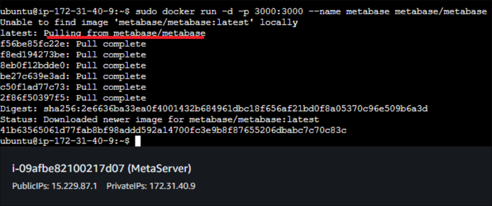

<h1>Configurar O Metabase no EC2 da AWS</h1>

<p align='justify'>Guia rápido de como colocar o Metabase para rodar em produção: remotamente em uma VM no EC2 da AWS.</p>

**1º passo: Virtualizar uma [instância no EC2](https://sa-east-1.console.aws.amazon.com/ec2/home?region=sa-east-1#Home:)**

<p align='justify'>Enquanto o VPC (Virtual Private Cloud) cria uma nuvem privada, o EC2 virtualiza a máquina. O EC2 precisa de uma nuvem privada e, para criar a nuvem, pode ser feito via EC2 ou no próprio VPC. No EC2, buscar "VPC padrão":</p>


<p align='justify'>A página aberta será dentro do ambiente do VPC. Aqui, clicar em "Executar instâncias no EC2":</p>


As opções de configuração da VM surgirão. Das configurações:

<ul><li><p align="justify"><b>Nome da instância:</b> Nome que quiser.</p></li></ul>


<ul><li><p align="justify"><b>Seleção da imagem:</b> Sistema operacional e sua capacidade. Quanto melhor a máquina a se virtualizar, mais cara será a hora dela ativa. A nível de teste, usar a mais barata. De resto, selecionar um OS Ubuntu:</p></li></ul>


    
<ul><li align="justify"><b>Tipo de instância:</b> Quanto melhor, mais caro:</p></li></ul>


<ul><li><p align="justify"><b>Configurações de rede:</b> Pode-se marcar as 3 caixas como abaixo e manter o IP de acesso como 0.0.0.0/0 (acessível de qualquer PC):</p></li></ul>


<ul><li><p align="justify"><b>Armazenamento e instanciar:</b> A capacidade de armazenamento default abaixo é suficiente para instalar o docker e a imagem do Metabase do docker. Por fim, instanciar como abaixo.</p></li></ul>


<p align="justify">No resumo, é possível ter um overview dos parâmetros. Uma única instância é suficiente. Mas poderia criar mais de uma para mais de um Metabase (um por cliente, etc.):</p>


<p align="justify">Quando se solicitar para rodar a instância dentro do painel de instâncias criadas no EC2, ela será aberta numa nova janela, apenas o PROMPT Linux:</p>


**2º passo: instalar o Docker e Metabase**

<p align="justify">Com a instância criada e no PROMPT, **atualizar os repositórios do Ubuntu** com o comando abaixo. **NOTA:** copiar e colar no PROMPT deve-se usar `CTRL+SHIFT+C` ou `CTRL+SHIFT+V`.</p>

```unix
sudo apt update
```

<p align="justify">Instalar o Docker com os comandos abaixo. Durante a isntalação, algumas confirmações serão requisitadas, basta dizer sim ("y"):</p>

```unix
sudo apt-get install \
    apt-transport-https \
    ca-certificates \
    curl \
    gnupg-agent \
    software-properties-common

curl -fsSL https://download.docker.com/linux/ubuntu/gpg | sudo apt-key add -

sudo add-apt-repository \
   "deb [arch=amd64] https://download.docker.com/linux/ubuntu \
   $(lsb_release -cs) \
   stable"

 sudo apt-get update
 sudo apt-get install docker-ce docker-ce-cli containerd.io
```

Ao final, para checar se o Docker foi instalado corretamente, executar:

```unix
sudo docker run hello-world
```

A mensagem Hello from docker deve retornar no PROMPT:


Instalar o Metabase através do Docker é no próprio PROMPT com os comandos e se poderá ver o progresso da instalação:

```unix
sudo docker run -d -p 3000:3000 --name metabase metabase/metabase
```



**4º passo: configurar o TCP de entrada**

<p align="justify">Após a instalação do Metabase, configurar os protocolos de entrada. Na configuração da instância, foi setado na seleção das 3 caixas ("configurações de rede") regras de saída: de qualquer IP (0.0.0.0/0) e protocolos HTTP, HTTPS e por chave. Mas é importante tornar as regras de entrada igualmente livres para fácil acesso. Buscar no EC2 a instância e editar suas regras conforme abaixo (porta 3000 e IP 0.0.0.0/0). Caso contrário, ao tentar acessar o Metabase no navegador, nada será retornado (vai crashar por tempo de espera).</p>


<p align="justify">A essa altura, o Metabase já estará pronto para uso. Acessá-lo é através do IP da instância gerada através da porta 3000 (padrão). Ex.: para um IP 15.229.87.1 seria: `http://15.229.87.1:3000`:</p>


<h1>Ip Elástico</h1>

<p align="justify">Ao derrubar a instâcia, o IP muito provavelmente será derrubado e um novo será gerado. Fazendo com que o acesso via web seja diferente. Para evitar isso, pode-se mascarar o IP com uma espécie de <i>alias</i>, o IP elástico ou <i>Elastic IP</i>, conforme abaixo no VPC da AWS:</p>


<p align="justify">Após criado, ele deve ser associado à instancia criada anteriormente:</p>


<p align="justify">Após criado e associado, pode ser visto dentro das instâncias do EC2 na instância associada o IP elástico criado a ser usado no acesso web:</p>


<p align="justify">Por fim, para as configurações do banco de dados precisa-se das credenciais de acesso (host, port, etc.):</p>


<p align="justify">Note também que o IP a ser usado é o IP elástico, não mais o IP padrão da máquina instanciada.</p>

<h1>Encerrar as instâncias e livrar os IPs</h1>

<p align="justify">Como os serviços da Amazon <b>não são gratuitos</b>, é importante ao término dos trabalhos encerrar:</p>

<ul><li><p align="justify"><b>As máquinas virtuais:</b></p></li></ul>
    


<ul><li><p align="justify"><b>IPs elásticos:</b></p></li></ul>


<ul><li><p align="justify"><b>Encerrar instância no EC2</b></p></li></ul>


<h1>Iniciar e terminar uma instância de modo automático</h1>

<p align="justify">Existe essa possibilidade, evitando ter de manualmente instanciar e terminar sempre que for utilizar. Mas, se houver uma aplicação instanciada 24 horas, pode-se colocar o Metabase junto (o que geralmente ocorre).</p>

---

**[Referências](https://jithinsisaac.github.io/posts/aws_metabase/)**
