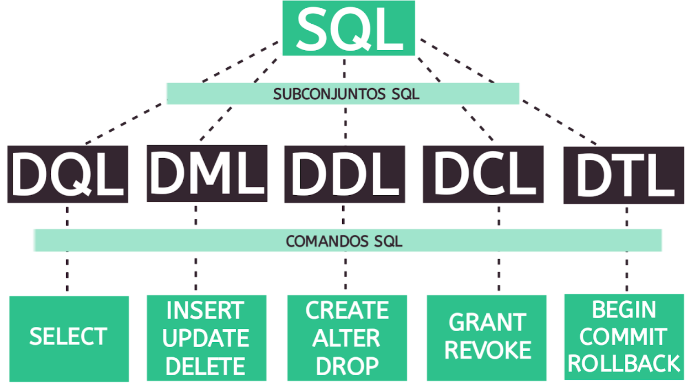

<h1>SQL</h1>

<p align="justify">Repositório de scripts e databases de estudo de SQL, feitos no MySQL v8+.</p>




<h3>MySQL - Conceitos</h3>

<p align="justify">
  <b>Storage Engine: </b>Camada de software responsável pelas operações básicas de um banco de dados: <b>criar, ler, atualizar e remover dados</b> (também chamada de <b>CRUD</b> pelos desenvolvedores, ou <i>create, read, update, delete</i>). Alguns exemplos são: <b>MyISAM, InnoDB</b>.
</p>

<p align="justify">
  O MyISAM tem prós e contras:
</p>

<ul>
  <li><p align="justify">Bom para situções de muitos selects e poucos inserts, updates e deletes. Ou seja, bom para consultas.</p></li>
  <li><p align="justify">Ruim para muitos inserts, updates e deletes por causa do <b>table locking</b>. <b>Locking</b> é o processo de travar uma linha ou tabela de receber qualquer operação externa enquanto a operação atual não for finalizada. O <b>problema da storage engine MyISAM é que o locking é feito na tabela, ficando ela inteira travada por conta do processo atual</b>.</p></li>
  <li><p align="justify">Outro ponto negativo é que não há suporte para chaves estrangeiras (foreign keys).</p></li>
</ul>

<p align="justify">
  O InnoDB tem prós e contras:
</p>

<ul>
  <li><p align="justify">Ruim para operações de muitos selects.</p></li>
  <li><p align="justify">Bom para operações de muitos inserts, updates e deletes. Seu locking é feito na linha e não na tabela, proporcionando maior concorrência de processos.</p></li>
  <li><p align="justify">Possui suporte a chaves eestrangeiras, permitindo maior integridade dos dados e maior desempenho em consultas select transacionais.</p></li>
</ul>

<table align="center"><thead><tr><th>STORAGE ENGINE</th><th>VANTAGENS</th><th>DESTANTAGENS</th></tr></thead><tbody><tr><td>MyISAM</td><td>selects rápidos</td><td>insert, update, delete lentos devido ao processamento sequencial dos comandos (locking na tabela) ; não há FK</td></tr><tr><td>InnoDB</td><td>insert, update, delete rápido pelo multi-processamento dos comandos (locking na linha) ; há FK</td><td>selects lentos</td></tr></tbody></table>

<p align="justify">Comparativo:</p>

<table align="center"><thead><tr><th>CARACTERÍSTICA</th><th>MyISAM</th><th>InnoDB</th></tr></thead><tbody><tr><td>Transações ACID</td><td>Não</td><td>Sim</td></tr><tr><td>Propriedades ACID configuráveis</td><td>Não</td><td>Sim</td></tr><tr><td>Crash Safe</td><td>Não</td><td>Sim</td></tr><tr><td>FKs</td><td>Não</td><td>Sim</td></tr><tr><td>Controle de concorrência multi versão (MVCC)</td><td>Não</td><td>Sim</td></tr><tr><td>Dados geospatial</td><td>Sim</td><td>Sim</td></tr><tr><td>Indexação geospatial</td><td>Sim</td><td>Não</td></tr><tr><td>Indexador para buscas full-text</td><td>Sim</td><td>Não</td></tr><tr><td>Cache de dados</td><td>Não</td><td>Sim</td></tr><tr><td>Compressão de dados</td><td>Sim</td><td>Sim</td></tr><tr><td>Limite de armazenamento</td><td>256TB</td><td>64TB</td></tr><tr><td>Custo de armazenamento</td><td>Baixo</td><td>Alto</td></tr><tr><td>Custo de memória</td><td>Baixo</td><td>Alto</td></tr><tr><td>Tipo de locking</td><td>Tabela</td><td>Linha</td></tr></tbody></table>

<p align="justify">
  Para selecionar a ENGINE, o mais adequado é no momento de criação do banco de dados. Segue:
</p>

```sql
CREATE DATABASE exemplo
  CHARACTER SET utf8mb4
  COLLATE utf8mb4_unicode_ci
  ENGINE = InnoDB;
```

<p align="justify">Contudo, também pode ser setado no momento da criação de cada tabela. Segue:</p>

```sql
CREATE TABLE tabela_exemplo (
  id INT PRIMARY KEY AUTO_INCREMENT,
  nome VARCHAR(50)
) ENGINE = InnoDB;
```

<p align="justify">
  Collate é um termo utilizado em bancos de dados para definir como os caracteres alfanuméricos são comparados e classificados. Ele determina a ordem e a sensibilidade dos caracteres em operações de comparação, como ordem alfabética em consultas SQL ou comparação de strings. O collate especifica o conjunto de regras que define como os caracteres são comparados, considerando fatores como sensibilidade a maiúsculas e minúsculas, acentos, caracteres especiais, entre outros. Por exemplo, em um collate case-insensitive (insensível a maiúsculas e minúsculas), as letras maiúsculas e minúsculas serão tratadas da mesma forma durante as comparações. Portanto, uma consulta que busca por "ABC" também retornará "abc" ou "AbC". Já em um collate case-sensitive (sensível a maiúsculas e minúsculas), as letras maiúsculas e minúsculas serão tratadas de forma distinta durante as comparações. Nesse caso, uma consulta que busca por "ABC" não retornará "abc" ou "AbC". Além disso, o collate também pode influenciar a ordem em que os caracteres são classificados. Por exemplo, em alguns collates, os caracteres com acentos podem ser classificados de forma diferente do que sem acentos.
</p>

<p align="justify">
  O COLLATE `utf8mb4_unicode_ci` é o mais comumente usado e suporta uma ampla gama de caracteres, incluindo caracteres multibyte, como emojis, e tem regras de classificação baseadas nas especificações do Unicode. Ele é case-insensitive e trata os caracteres acentuados de maneira correta durante as comparações. Esse collate é especialmente útil para aplicações que exigem suporte a uma ampla variedade de linguagens e caracteres, como aplicações web internacionais.
</p>

<p align="justify"><a href="https://dev.mysql.com/doc/refman/5.7/en/storage-engines.html">Referência</a></p>

<p align="justify"><b>Transações ACID</b></p>

<p align="justify">As transações ACID são um conjunto de propriedades que garantem a consistência, a integridade e a atomicidade das transações em um banco de dados. Essas propriedades garantem a confiabilidade e a integridade dos dados no banco de dados, tornando as transações ACID a base para sistemas transacionais confiáveis.</p>

<ul>
  <li><p align="justify"><b>Atomicidade: </b>Uma transação é uma unidade indivisível de execução, o que significa que todas as ações dentro da transação devem ser concluídas com sucesso ou nenhuma ação deve ser executada. Se uma ação não puder ser concluída, todas as ações anteriores devem ser desfeitas (rollback).</p></li>
  <li><p align="justify"><b>Consistência: </b>Uma transação deve levar o banco de dados de um estado consistente para outro estado consistente. Isso significa que todas as regras e restrições definidas no banco de dados devem ser atendidas durante a execução da transação.</p></li>
  <li><p align="justify"><b>Isolamento: </b>Cada transação deve ser executada de forma isolada, sem interferências de outras transações concorrentes. Isso significa que o resultado de uma transação não pode ser afetado por outras transações em execução simultaneamente.</p></li>
  <li><p align="justify"><b>Durabilidade: </b>Uma vez que uma transação é concluída com sucesso, suas alterações no banco de dados devem se tornar permanentes, mesmo em caso de falhas de sistema ou de energia. Isso garante que as alterações persistam e possam ser recuperadas no futuro.</p></li>
</ul>

<p align="justify"><b>Crash safe</b></p>

<p align="justify">"Crash safe" é um termo usado para descrever a capacidade de um sistema ou aplicativo de se recuperar de um "crash" ou falha de sistema de maneira segura e sem perda de dados. Quando um sistema ou aplicativo é considerado "crash safe", significa que ele foi projetado para lidar com falhas inesperadas, como quedas de energia, falhas de hardware ou falhas de software, sem comprometer a integridade dos dados. Existem várias técnicas e práticas utilizadas para tornar um sistema ou aplicativo "crash safe", como o uso de transações ACID, a escrita de registros de log para registrar todas as operações e alterações nos dados, a implementação de mecanismos de recuperação em caso de falhas, entre outros. Em resumo, ser "crash safe" significa que um sistema ou aplicativo possui mecanismos e recursos que o tornam capaz de se recuperar de falhas de forma segura e confiável, minimizando ou eliminando a perda ou corrupção de dados.</p>

<p align="justify"><b>Controle de concorrência multi versão (MVCC)</b></p>

<p align="justify">O Controle de Concorrência Multi Versão (MVCC - Multi-Version Concurrency Control) é um mecanismo utilizado em bancos de dados para gerenciar o acesso simultâneo às informações por múltiplas transações. Ao invés de utilizar bloqueios tradicionais para controlar o acesso concorrente, o MVCC permite que diferentes transações leiam e escrevam dados ao mesmo tempo, sem a necessidade de bloquear completamente o acesso a um dado específico.</p>

<p align="justify">No MVCC, cada transação enxerga uma "versão" consistente do banco de dados, mesmo que outras transações estejam realizando mudanças no mesmo dado ao mesmo tempo. Essas versões são mantidas por meio do controle de timestamps ou outros mecanismos de controle, atribuindo um número de versão a cada transação. Quando uma transação realiza uma leitura, ela recebe a versão do dado que era válida no momento em que ela iniciou. Caso a transação esteja realizando uma escrita, uma nova versão do dado é criada e atualizada, e outras transações continuarão a enxergar a versão consistente que foi lida inicialmente.</p>

<p align="justify">O MVCC traz benefícios como o aumento do desempenho, já que várias transações podem acessar os dados simultaneamente, e a redução de bloqueios, o que evita problemas de bloqueio mútuo entre transações concorrentes. No entanto, o MVCC também pode consumir recursos adicionais de armazenamento para manter as versões dos dados. Essa abordagem é comum em bancos de dados relacionais modernos, como o <b>PostgreSQL</b>, que implementa o MVCC como padrão para garantir a consistência e o controle de concorrência.</p>

<p align="justify"><b>Dados geospatial e indexação geospatial</b></p>

<p align="justify"></p>

<p align="justify">Dados geoespaciais ou geospatial são informações que possuem uma componente geográfica, como coordenadas de latitude e longitude que representam uma localização específica na superfície da Terra. Esses dados são amplamente utilizados em diversos setores, incluindo cartografia, geografia, análise de localização, projetos de infraestrutura, sistemas de navegação, entre outros.</p>

<p align="justify">A indexação geoespacial é um método de organização e otimização de dados geoespaciais em bancos de dados para facilitar consultas e análises espaciais. A indexação tem como objetivo tornar mais eficiente a busca de dados com base na localização geográfica.</p>

<p align="justify">Existem várias estruturas de índice geoespacial comumente usadas, incluindo:</p>

<ul>
  <li><p align="justify"><b>Índice R-tree: </b>É uma estrutura de árvore multidimensional que organiza os dados geoespaciais em uma hierarquia. Cada nó da árvore agrupa objetos geoespaciais próximos uns dos outros, permitindo consultas eficientes baseadas em regiões.</p></li>
  <li><p align="justify"><b>Quadtree: </b>É uma estrutura de árvore quad-dimensional que divide repetidamente o espaço geográfico em quadrantes menores. Permite busca eficiente por região e agrupamento de pontos próximos.</p></li>
  <li><p align="justify"><b>Grid Indexing: </b>Divide a área geográfica em uma grade uniforme e atribui um identificador a cada célula. Essa grade cria uma estrutura de índice eficiente para consultas e análises espaciais.</p></li>
</ul>

<p align="justify">Essas técnicas de indexação geoespacial permitem consultas como encontrar todos os pontos dentro de uma área retangular ou encontrar o ponto mais próximo a uma determinada localização. A indexação geoespacial torna possível realizar consultas complexas de forma eficiente, melhorando o desempenho de sistemas que lidam com dados geoespaciais.</p>
